# BIO_FINAL_PROJECT

Ссылка на Google Collab:

Часть файлов, размер который позволяет быть расположены в Github, смотри выше.

Полный набор файлов по ссылке: https://drive.google.com/drive/folders/1N9fAjzVA0YU65U-A9DtbvPsQKiT69vQj?usp=sharing

## Часть №1 Анализ аннотированных генов 

### **Данные**
1) Название вида
2) Количество последовательностей в геноме
3) Общая длина этих последовательностей
4) Количество аннотированных генов

## Часть №2 Ассоциируем предсказанные участки Z-DNA

### **Данные**

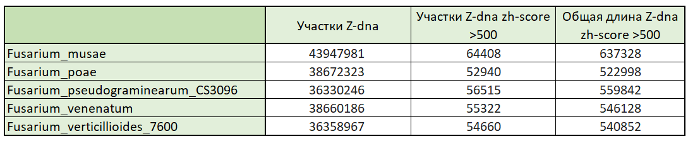

### **ZH-score > 500**

Fusarium_musae

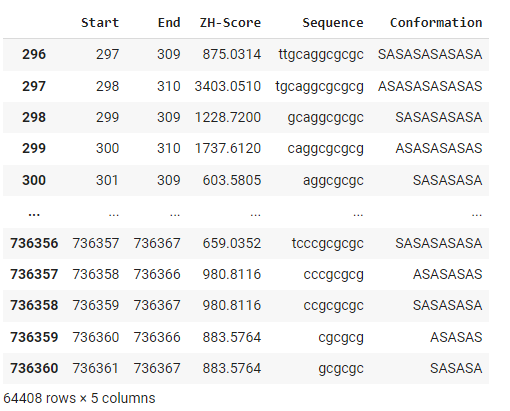

Fusarium_poae

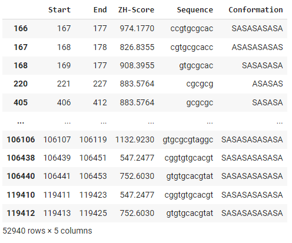

Fusarium_pseudograminearum_CS3096

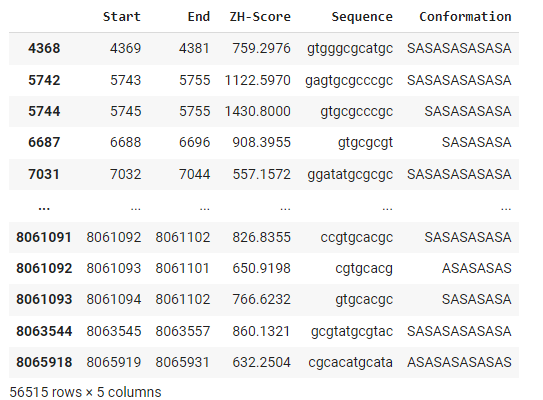

Fusarium_venenatum

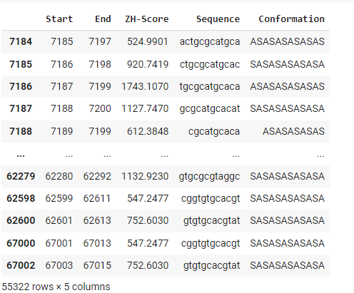

Fusarium_verticillioides_7600

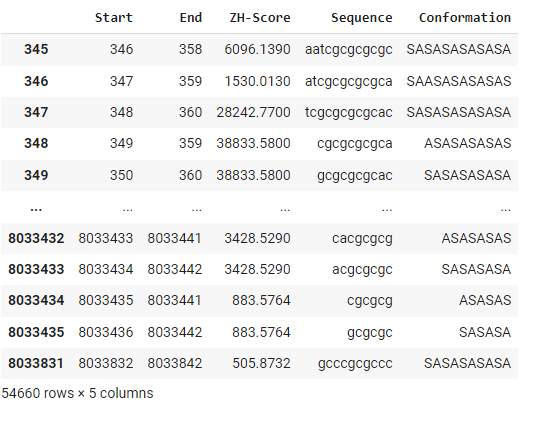

**Гистограммы значений zh-score для всех геномов, полученных с помощью Zhunt**

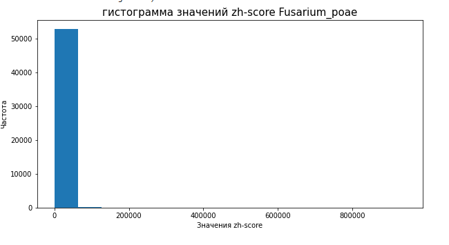

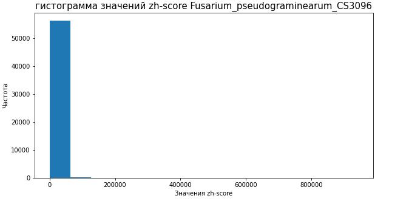

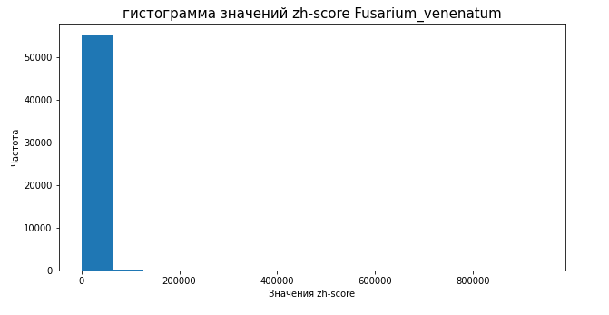

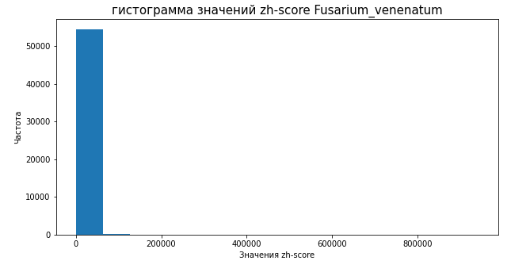

## Задание 3. Ассоциация предсказанных участков Z-DNA с промотерами генов

### Визуализация

Fusarium_musae

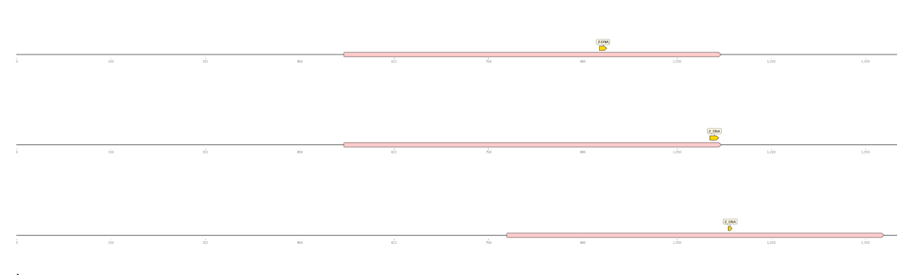

Fusarium_poae

Fusarium_pseudograminearum_CS3096

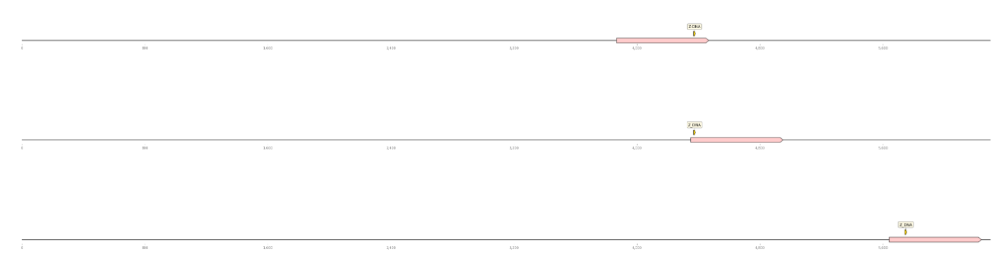

Fusarium_venenatum

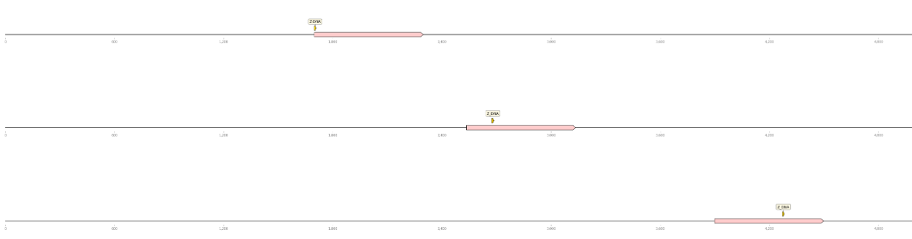

Fusarium_verticillioides_7600

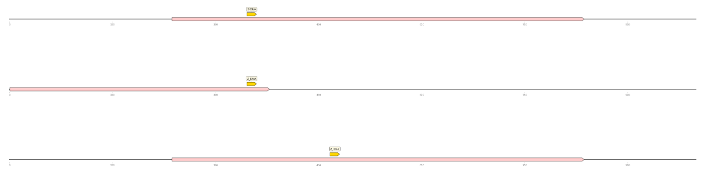
