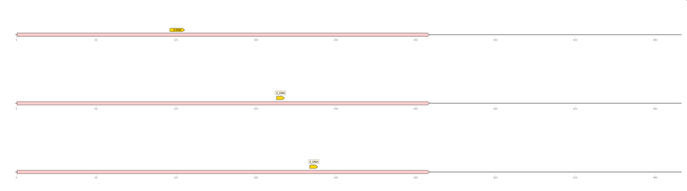
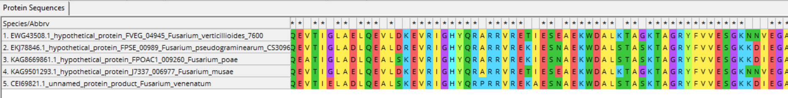
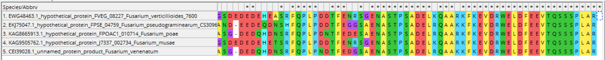

# BIO_FINAL_PROJECT

Ссылка на Google Collab: https://colab.research.google.com/drive/1P427y2PyMykLUq0_3LEhbfLVZjTMGQE4?usp=sharing

Часть файлов, размер который позволяет быть расположены в Github, смотри выше.

Полный набор файлов по ссылке: https://drive.google.com/drive/folders/1N9fAjzVA0YU65U-A9DtbvPsQKiT69vQj?usp=sharing

## Часть №1 Анализ аннотированных генов 

### **Данные**
1) Название вида
2) Количество последовательностей в геноме
3) Общая длина этих последовательностей
4) Количество аннотированных генов

## Часть №2 Ассоциируем предсказанные участки Z-DNA

### **Данные**

### **ZH-score > 500**

Fusarium_musae

Fusarium_poae

Fusarium_pseudograminearum_CS3096

Fusarium_venenatum

Fusarium_verticillioides_7600

**Гистограммы значений zh-score для всех геномов, полученных с помощью Zhunt**

## Задание 3. Ассоциация предсказанных участков Z-DNA с промотерами генов

### **Данные**

Количество кластеров

Выбранные данные:

Функции:

### Визуализация

Fusarium_musae

Fusarium_poae

Fusarium_pseudograminearum_CS3096

Fusarium_venenatum

Fusarium_verticillioides_7600

### Гистограмма кластеров

### Clustal

Полный файлы в папке fasta

### Визуализация

Clust 1

Clust 2

Clust 3

Clust 4

Clust 5

